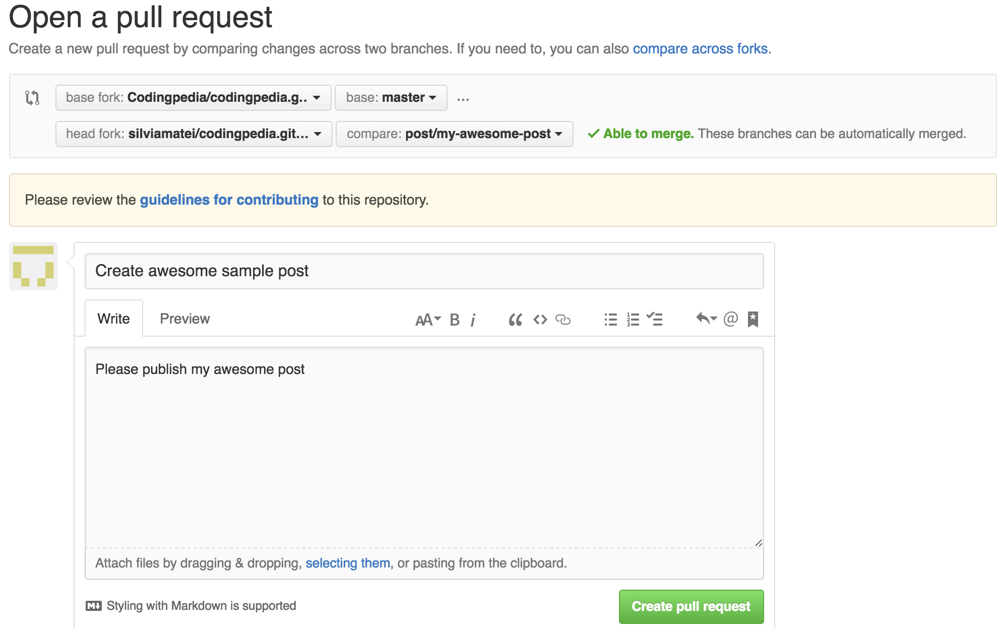

# Contributing to Codepedia.org could mean several things

1. Contribute to the website itself (bugfixes and new features)
2. Contribute with a [new post to Codepedia.org](CONTRIBUTING_POST.md)
3. Last but not least, **sharing is caring**

> If you want to contribute with a new post make sure you read the [Contribute post guide](CONTRIBUTING_POST.md)
once you have finished this one

Both require some common things which are listed below:

## Getting Started
* Make sure you have a [GitHub account](https://github.com/signup/free)
* Fork the [repository](https://github.com/CodepediaOrg/codepediaorg.github.io) on GitHub

## Requirements
We recommend using [Bundler](https://bundler.io/) to install and run Jekyll. Bundler manages Ruby gem dependencies, reduces Jekyll build errors, and prevents environment-related bugs. To install Bundler, you must install [Ruby](https://www.ruby-lang.org/).

### 1 Open terminal

### 2 Check whether your have Ruby 2.0.0 or higher installed:
```shell
$ ruby --version
ruby 2.X.X
```
### 3 If don't have Ruby installed, [install Ruby 2.0.0 or higher](https://www.ruby-lang.org/en/downloads/).

### 4 Install bundler
```shell
$ gem install bundler
# Installs the Bundler gem
```

## Step 1: Set up a working copy on your computer
Firstly you need a local fork of the the [CodepediaOrg project](https://github.com/CodepediaOrg/codepediaorg.github.io), so go ahead and press the "fork" button in GitHub. This will create a copy of the repository in your own GitHub account and you'll see a note that it's been forked underneath the project name:

Now you need a copy locally, so find the "SSH clone URL" in the right hand column and use that to clone locally using a terminal:
<pre><code class="bash">git clone https://github.com/your_github_account/codepediaorg.github.io.git</pre></code>

Change now to your project's directory:
<pre><code class="bash">cd codepediaorg.github.io</pre></code>

Finally, in this stage, you need to set up a new remote that points to the original project so that you can grab any changes and bring them into your local copy. Firstly clock on the link to the original repository – it's labeled "Forked from" at the top of the GitHub page. This takes you back to the projects main GitHub page, so you can find the "SSH clone URL" and use it to create the new remote, which we'll call **upstream**.

<pre><code class="bash">git remote add upstream https://github.com/CodepediaOrg/codepediaorg.github.io.git</pre></code>

You now have two remotes for this project on disk:

1. origin which points to your GitHub fork of the project. You can read and write to this remote.
2. upstream which points to the main project's GitHub repository. You can only read from this remote.

## Step 2: Do some work

**The number one rule is to put each piece of work on its own branch.**

Branch from the **master** branch. Give your branch a relevant name,
like __post/my-awesome-post__ (if it's a new post you'd like being published), __feature/my-awesome-feature__ or __bugfix/my-awesome-fix__:

<pre><code class="bash">
$ git checkout master
$ git pull upstream master && git push origin master
$ git checkout -b post/my-awesome-post
</pre></code>

Firstly we ensure we're on the master branch. Then the git pull command will sync our local copy with the upstream project
and the git push syncs it to our forked GitHub project. Finally we create our new branch.

Now you can do the work.

## Step 3: Test your work locally

Navigate into the root directory of CodepediaOrg Jekyll site repository.
Install Jekyll and other dependencies from the GitHub Pages gem:
```shell
$ bundle install
Fetching gem metadata from https://rubygems.org/............
Fetching version metadata from https://rubygems.org/...
Fetching dependency metadata from https://rubygems.org/..
Resolving dependencies...
```

Run Jekyll site locally
```shell
$ bundle exec jekyll serve
Configuration file: /Users/octocat/my-site/_config.yml
           Source: /Users/octocat/my-site
      Destination: /Users/octocat/my-site/_site
Incremental build: disabled. Enable with --incremental
     Generating...
                   done in 0.309 seconds.
Auto-regeneration: enabled for '/Users/octocat/my-site'
Configuration file: /Users/octocat/my-site/_config.yml
   Server address: https://127.0.0.1:4000/
 Server running... press ctrl-c to stop.
```

Preview your local Jekyll site in your web browser at <code>http://localhost:4000</code>

Once you are satisfied with your changes, go ahead and:

## Step 4: Create a Pull Request

To create a PR you need to push your branch to the origin remote and then press some buttons on GitHub.

To push a new branch:
<pre><code class="bash">
$ git push -u origin hotfix/readme-update
</pre></code>

This will create the branch on your GitHub project. The -u flag links this branch with the remote one, so that in the future,
you can simply type git push origin.
This will create the branch on your GitHub project. The -u flag links this branch with the remote one, so that in the future, you can simply type <code>git push origin</code>.

Swap back to the browser and navigate to your fork of the project (**https://github.com/your_github_account/codepediaorg.github.io**)
and you'll see that your new branch is listed at the top with a handy "Compare & pull request" button:


Go ahead and press the button!



On this page, ensure that the "base fork" points to the correct repository and branch.

> The __guidelines for contributing__ link from the yellow box will lead you to this guide.

Then ensure that you provide a good, succinct title for your pull request and explain why you have created it in the description box.
Add any relevant issue numbers if you have them.

If you scroll down a bit, you'll see a diff of your changes. Double check that it contains what you expect.

Once you are happy, press the "Create pull request" button and you're done.

## Step 4: Review by the maintainers

For your work to be integrated into the project, the maintainers of the projet will review your work and either request changes or merge it.

## Summary

That's all there is to it. The fundamentals are:

1. Fork the project & clone locally.
2. Create an __upstream__ remote and sync your local copy before you branch.
3. Branch for each separate piece of work.
4. Do the work, test locally, write [good commit messages](https://blogs.gnome.org/danni/2011/10/25/a-guide-to-writing-git-commit-messages/), and re-read this CONTRIBUTING guide.
5. Push to your origin repository.
6. Create a new Pull Request in GitHub.
7. Respond to any code review feedback.

> This guide is an adaptation for Codingpeida from the wonderful post [The beginner's guide to contributing to a GitHub project](https://akrabat.com/the-beginners-guide-to-contributing-to-a-github-project/)
