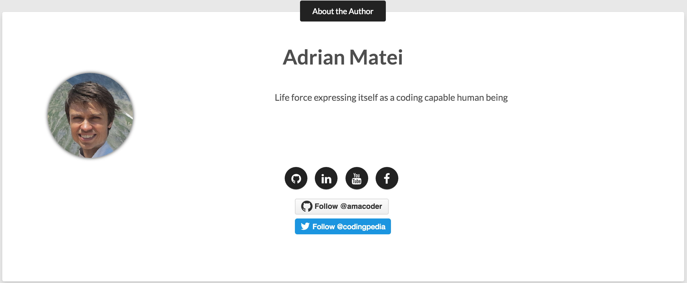

> Please read the [Contributing guide](CONTRIBUTING.md) guide first to make sure
you have the right setup in place to contribute a new post to Codingpedia.org

Codingpedia.org is developed currently with [Jekyll](https://jekyllrb.com/), so there are some
standard rules you need to follow, but as you'll see in the coming paragraphs that is very easy and makes a lot of sense.

## 1 Add information about you

> Before you first commit, don't forget to branch

Open the file [_data/authors.yml](_data/authors.yml) in your favorite editor, and at the end of the file add
information about yourself as in the following example:

```yaml
ama:
  name:          Adrian Matei
  site:           http://www.codingpedia.org
  avatar:         images/authors/amacoder.png
  bio:            "Life force expressing itself as a coding capable human being"
  email:          adrianmatei@gmail.com
  # Twitter nick for use in Twitter cards and follow button.
  twitter: codingpedia # if no twitter in this config, the twitter follow button will be removed
  # GitHub nick for use in follow button in author block.
  github: amacoder
  social:
    - title: "github"
      url: "https://github.com/adrianmatei-me"
    - title: "linkedin"
      url: "https://www.linkedin.com/in/adrianmatei1983"
    - title: "youtube"
      url: "https://www.youtube.com/channel/UCZT1MatBdHWnVLl0OkcED3Q"
    - title: "facebook"
      url: "https://www.facebook.com/adrian.matei.90"
```
Let's go through the elements now one by one:
* The first element (here **ama**) is very important, as it is used in your posts to identify you, the author
* **name** - your name
* **site** - your website, where visitors can find out more about you; it is the the "About Your Name" link 
* **avatar** - a picture of you, please upload one in the __images/authors/folder__
* **bio** - short information about you
* **email** - your email address
* **twitter** - your twitter account name
* **github** - your github account name
* **social** - here you can list your accounts on the different social media, but make sure you add the complete url

The result is placed at the end of your posts and looks something like the following:


## 2 Write your post

### 2.1 Placement and naming convention

Your new post has to conform to the following rules
* it needs to be added in the [_posts](_posts) directory
* the naming convention of your new file is important, and must follow the format: <code>YEAR-MONTH-DAY-title.md</code>.
The permalinks can be customized for each post, but the date and markup language (in our case [Markdown](http://daringfireball.net/projects/markdown/)) are determined solely by the file name.
(e.g. 2014-02-17-javascript-hoisting-example-reloaded.md)

### 2.2 Configure the front-matter of the post

The front matter must be the first thing in the file and must take the form of valid [YAML](https://en.wikipedia.org/wiki/YAML) set between triple-dashed lines. Here is a basic example:
```
---
layout: post
title: How to insert and highlight code in Jekyll blog post on Codingpedia.org
description: "Demo post displaying the various ways of inserting and highlighting code in Markdown, when posting on Codingpedia.org"
author: ama
permalink: /ama/how-to-insert-and-highlight-code-in-jekyll-blog-post-on-codingpedia-org
modified: 2014-12-23
tags: [sample post, code, highlighting]
categories: [intro]

# properties only relevant if this is a republished post
republished: true
original_title: How to insert and highlight code in jekyll blog post on Codingpedia.org
original_url: http://www.codingpedia.org/ama/how-to-insert-and-highlight-code-in-jekyll-blog-post-on-codingpedia-org
---
```

Let's have again a look at the different elements now
* **layout** - needs to be set to **post**
* **title** - the title of your post; one tip here is that the title of your blog post should include a keyword, but just be sure to keep your [long-tail keyword](https://yoast.com/focus-on-long-tail-keywords/) under 70 characters. The title of your post will be a search engine and reader's first step in determining the relevancy of your content, so including a keyword here is vital.
* **description** - short description of your post, shoul be no more than 140 characters
* **author** - the author you have previously defined in the [_data/auhors.yml](_data/auhors.yml)
* **permalink** - this is added to __http://www.codingpedia.org/__ and will form the post's URL; the permalink should have the format [__author/seo-friendly-title__]; **author** is the name specified before;
**seo-frienly-title** could be your title with hyphens instead of spaces; to find out more about SEO friendly url follow [this link](http://www.codingpedia.org/ama/seo-friendly-url-construction-with-spring-mvc/#What_is_a_friendly_URL)
* **modified** - the date when the post was last modified in [yyyy-MM-dd] format
* **tags** - relevant tags/keywords for the post - no more than 5; see the [tags page](http://www.codingpedia.org/tags/) for already used tags
* **categories** - relevant categories - no more than 2;  see the [categoreis page](http://www.codingpedia.org/categories/) for already used categories
* **republished** - these three properties are relevant only when the post is republished from another website; it generates the __Republished from paragraph...__ at the end of the post
* **original_title** - title of the original post
* **original_url** - URL of the original post

### 2.3 Post

Things to consider when writing a post:
* add a short introduction, where you tell the readers what the post is about
* after the short introduction put in a <code><!--more--></code> tag; this will end the excerpt shown before
<code>Continue reading</code>, when the post is present in a list
* you most likely will include **code** - see [How to insert and highlight code in Jekyll blog post on Codingpedia.org]({{ site.url }}/ama/how-to-insert-and-highlight-code-in-jekyll-blog-post-on-codingpedia-org) for the different possibilities to insert code in your post
* give credit to others and put reference links at the end of the article
* be polite and open when replying to comments
* make sure you comply with our [Publishing Policies](http://www.codingpedia.org/contributors/publishing-policy/)

We are looking forward to your contribution to the coding community and please leave a comment if something is unclear to you - thank you.

<p style="text-align: justify; padding-left: 30px;">
  <em><strong>Note:</strong> No time to contribute original posts to Codingpedia.org yet, but you strongly believe you have coding-related articles worth sharing, then you can join our <a title="Coding Friend Program" href="http://www.codingpedia.org/friends" target="_blank">Coding Friend Program</a> and have your best ones republished. </em>
</p>
